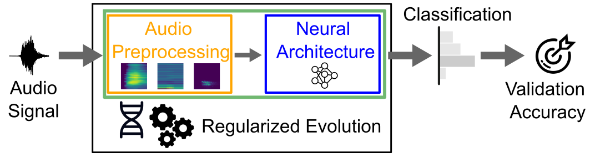

# ICASSP 2025 Submission: Synergistic audio pre-processing and neural architecture design maximizes performance

This repository contains the code for the paper titled "Synergistic audio pre-processing and neural architecture design maximizes performance," which was submitted to ICASSP 2025.



## Python Version

Python version: 3.10.12

## Installation

To set up the environment, run the following commands:

```bash
python3 -m venv .venv
pip install nni torch torchvision torchaudio pytorch_lightning fcwt matplotlib
```

## Datasets

The datasets are automatically downloaded when running the `run_experiments.py` script for the first time on a specific dataset.

## Running Experiments

To reproduce our results, you can execute the following steps:

### OptModel

To run the OptModel experiment, use the following command:

```bash
python run_experiment.py --experiment 1 --dataset [speech_commands, esc50, spoken100]
```

### OptPre

To run the OptPre experiment, use the following command:

```bash
python run_experiment.py --experiment 2 --dataset [speech_commands, esc50, spoken100] --model [mobilenetv2, mobilenetv3small, mobilenetv3large]
```

### OptBoth

To run the OptBoth experiment, use the following command:

```bash
python run_experiment.py --experiment 3 --dataset [speech_commands, esc50, spoken100]
```

